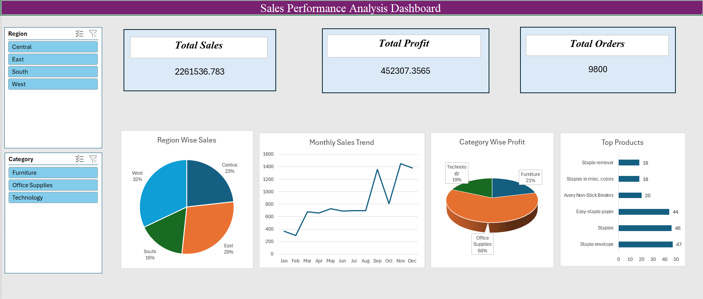

#  Sales Performance Analysis Dashboard (Excel)

##  Project Objective

This project focuses on analyzing sales data using Microsoft Excel to derive meaningful business insights. The dashboard helps in:

* Identifying top-performing regions
* Tracking monthly sales trends
* Evaluating product performance
* Analyzing overall profit and loss

---

##  Dataset

* Superstore Sales Dataset
* Contains fields like Order ID, Sales, Category, Region, and Order Date

---

##  Project Structure

### 1️ Data Cleaning

* Removed duplicate records
* Standardized text using TRIM and PROPER
* Corrected date formats

---

### 2 Data Preparation

Additional columns created:

* **Profit**

  ```
  =Sales * 0.2
  ```

* **Profit Status**

  ```
  =IF(Profit>0,"Profit","Loss")
  ```

* **Month**

  ```
  =TEXT(Order_Date,"mmm")
  ```

---

### 3️ Data Analysis (Pivot Tables)

Created the following pivot tables:

* Region-wise Sales
* Category-wise Profit
* Monthly Sales Trend
* Top 5 Products

---

##  Dashboard Features

###  KPIs (Top Section)

* Total Sales
* Total Profit
* Total Orders

###  Charts

* 📈 Line Chart → Monthly Sales Trend
* 📊 Bar Chart → Top 5 Products
* 🥧 Pie Chart → Category-wise Profit Distribution
* 🥧 Pie Chart → Region-wise Sales

### Filters (Slicers)

* Region
* Category

---

##  Dashboard Highlights

* Interactive dashboard using slicers
* Clean and structured layout
* KPI cards for quick insights
* Dynamic filtering of charts

---

##  Dashboard Preview



---

##  Tools Used

* Microsoft Excel
* Pivot Tables
* Charts
* Slicers
* Data Cleaning Functions

---

##  Key Insights

* West region contributes the highest sales
* Office Supplies category generates the most profit
* Sales trend fluctuates across months
* Top products significantly influence revenue

---

##  Conclusion

This dashboard provides an interactive and visual way to analyze sales data and supports better decision-making.

---

##  Author

Riya Ramteke
